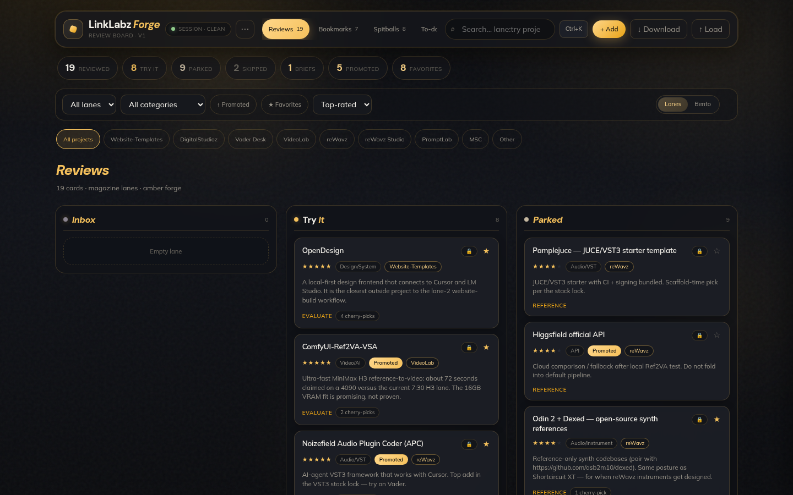

# ⚡ LinkLabz — Forge Preview

> Ravyn's amber/charcoal rebuild of Jon's **LinkLabz** link-review board — magazine
> lanes, command palette, to-do queue, and a Muse-parity workflow tuned for
> harvesting links worth stealing.

[](https://jonbeatz.github.io/linklabz-forge-preview/)
[](https://github.com/jonbeatz/linklabz-forge-preview/commits/main)
[](https://github.com/jonbeatz/linklabz-forge-preview)


**🚀 Live preview:** https://jonbeatz.github.io/linklabz-forge-preview/



## What's inside

- **Floating command island** — search, ⌘K palette, Download/Load workspace, and a quiet ⋯ for Reset to seed.
- **Magazine lanes** — Inbox / Try It / Parked / Skipped with bento toggle, project chips, and operator search (`lane:`, `project:`, `hardware:`, `found:`, `action:`).
- **Full shelves** — Reviews, Bookmarks (typed), Spitballs (graduate → Inbox), To-do (project, severity, park, inline edit, clear done), Favorites, Tools.
- **Detail drawer** — sticky amber strip, Copy Markdown / bridge note, linked to-do, evidence checklist, protected-seed lock, Evaluate → add to-do prompt.
- **DM Sans + Mulish** wordmark treatment — white lead + amber italic accent on section and lane titles.
- **PWA-ready** — Add to Home Screen manifest + icons; Session · Clean/Dirty chip.
- **Full dataset preserved** — **19 reviews**, **7 bookmarks**, **8 spitballs**, **7 to-dos** (Muse snapshot + Trinity staged package + spitball parking lot).
- **Concepts (test)** — GodUI-inspired Card Swap and Cover Flow, fed by the same review cards. Experimental only; Reviews still defaults to Lanes and Bento.

## Test layouts

Open the **Concepts** pill (or command palette → Concepts). These are vanilla CSS/JS ports of the GodUI card-swap stack and cover-flow carousel — not a new production board.

- **Card Swap** — fixed 3D stack of the top-rated reviews, auto-advances, pauses on hover, prev/next. Click the front card to open the detail drawer.
- **Cover Flow** — drag with momentum, click a side card, or use prev/next and arrow keys when the stage is focused. Click the centered card to open it.
- `prefers-reduced-motion` flattens both: instant swaps with no tilt, and a flat cross-fade instead of the 3D spin.

## Tech stack

| Layer   | Choice                                                                  |
| ------- | ----------------------------------------------------------------------- |
| Markup  | `index.html` + `styles.css` + `app.js` (no build step)                  |
| Runtime | Browser only — serve via static host / GitHub Pages                     |
| Hosting | GitHub Pages from `main` (`.nojekyll`, no Jekyll pass)                  |
| Data    | `data/seed.json` → `localStorage` (`linklabz-forge-v1.2`); lanes: Reviews / Bookmarks / Spitballs / To-do |

## Project structure

```text
linklabz-forge-preview/
├── index.html              # app shell
├── styles.css              # amber / charcoal forge theme
├── app.js                  # board logic + shelves + palette
├── manifest.webmanifest    # PWA / home-screen
├── data/
│   └── seed.json           # reviews · bookmarks · spitballs · todos
├── assets/
│   └── screenshot.png      # README hero shot
├── .nojekyll               # tell Pages to serve files as-is
└── README.md
```

## Workflow — branches, not overwrites

`main` always mirrors the latest approved build. Every change gets cut as a
**new branch** off `main` and lands via PR. Nothing is silently replaced on
`main`.

## Use this repo as a template

Same house pattern as the Trinity preview:

1. Title + one-line description of whose build it is and what changed.
2. Badge row: Pages deploy status, last commit, repo size, site type.
3. Live preview link, then a real screenshot (`assets/screenshot.png`).
4. "What's inside" — the feature list in plain language.
5. "Tech stack" — the table above; keep it honest and short.
6. "Project structure" — the tree, so the next person knows where things live.
7. "Workflow" — the branching rule, so `main` never gets quietly overwritten.
